# Jetson 完全指南：选型·刷机·环境配置

**by ZYL**

## 前言

### 1. Jetson 开发板与 Tegra 芯片

Jetson 系列开发板采用的 SoC 是 NVIDIA **Tegra** 系列芯片（刷机和查看系统信息时都能看到 "tegra" 字样）。Tegra 是英伟达的 SoC 品牌，类似高通的骁龙系列和联发科的天玑系列。

早期 Tegra 芯片同时用于消费移动设备和边缘计算开发板,例如：

- **Tegra 4** — 小米手机 3、Surface RT 2
- **Tegra K1** — 小米平板 1、Jetson TK1（初代 Jetson 开发板）
- **Tegra X1** — 初代 Switch、初代 Jetson Nano

由于功耗控制和应用兼容性等问题，英伟达在 Tegra X1 之后不再将 Tegra 芯片面向普通消费级移动设备，仅用于 Jetson 系列开发板。唯一的例外是 **Switch 2**，它使用了与 Jetson Orin NX 同款的 Tegra T239 芯片。

### 2. Jetson 的 Tegra SoC 架构

Tegra 系列 SoC 的设计思路与手机芯片类似：

- **CPU** — 公版/魔改的 Arm/Arm64 Cortex架构
- **GPU** — 与 NVIDIA 自家独显相同的 GPU 架构,不过由于Tegra系列更新频率与消费端不同,往往是跨代更新,比如Orin的显卡是30系显卡架构而其下一代Thor是50系显卡架构
- **内存** — 统一内存设计（CPU 与 GPU 共用），类似手机 SoC的思路

可以将其理解为一个**使用了英伟达独显作为核显的手机 SoC**

各代架构差异：

- **Xavier 系列（2018）** — CPU 为 Carmel 架构（魔改版 Cortex-A57，骁龙 810 同款大核），GPU 为 **Volta** 架构，介于 Pascal（10 系）与 Turing（16/20 系）之间。相比 Pascal 多了 **Tensor Core**，适合 TensorRT 推理加速；但缺少 **RT Core**，不支持光追运算。
- **Orin 系列（2022）** — CPU 为 **Cortex-A78AE** 架构（骁龙 888 同款大核），GPU 为 **Ampere** 架构（与 RTX 30 系同代，细节差异下文详述）。

更早的 TK1、TX1、TX2 和初代 Jetson Nano 过于古老,Thor系列太新一时半会用不到，本文不再详细介绍。

### 3. Jetson 的软件生态

由于 CPU 采用 **ARM64** 架构，且英伟达 GPU 驱动**不开源**，Jetson 可用的操作系统极为有限：

- 仅能使用英伟达官方提供的 **JetPack**——本质上是魔改并加入了英伟达私有驱动的 ARM64 版 Ubuntu。
- 仅能通过 **SDK Manager** 进行刷机和部分运行库（CUDA、TensorRT 等）的安装。
- 软件源与其他 ARM 开发板一样使用 ARM64 源，但不少库需要安装特殊版本或**源码编译**才能利用 GPU 加速，例如：
  - **OpenCV** — 需源码编译 CUDA 扩展版本
  - **PyTorch** — 需安装 NVIDIA 官方为 Jetson 定制的 ARM64 版本

## Jetson 全系列型号规格参数对比

### 1. 早期架构系列（Kepler / Maxwell / Pascal）

涵盖 TK1、TX1、TX2 全系（含 4GB、i、NX）及 初代 Nano 系列。这些型号的Jetson的性能和软件支持过于落后，不再推荐采购和在比赛中使用

| **型号**              | **发布时间** | **AI 算力**        | **GPU 架构 / CUDA 核心数** | **CPU**             | **内存**               | **功耗**  | **JetPack 支持** | **CUDA 版本** | **TensorRT 版本** |
| :-------------------- | :----------- | :----------------- | :------------------------- | :------------------ | :--------------------- | :-------- | :--------------- | :------------ | :---------------- |
| **Jetson TK1**        | 2014         | 327 GFLOPS (FP32)  | Kepler / 192               | 4核 ARM Cortex-A15  | 2GB LPDDR3             | < 6W      | 2.0 - 2.3.1      | 6.5           | 不支持            |
| **Jetson TX1**        | 2015         | 1 TFLOPS (FP16)    | Maxwell / 256              | 4核 ARM Cortex-A57  | 4GB LPDDR4             | < 10W     | 2.3 - 4.6        | 7.0 - 10.0    | 2.1 - 4.0         |
| **Jetson TX2 (8GB)**  | 2017         | 1.33 TFLOPS (FP16) | Pascal / 256               | 2核Denver2 + 4核A57 | 8GB LPDDR4             | 7.5 - 15W | 3.0 - 4.6        | 8.0 - 10.2    | 4.0 - 8.0         |
| **Jetson TX2 4GB**    | 2017         | 472 GFLOPS (FP16)  | Maxwell / **128**          | 4核 ARM Cortex-A57  | 4GB LPDDR4             | 7.5 - 15W | 3.0 - 4.6        | 8.0 - 10.2    | 4.0 - 8.0         |
| **Jetson TX2i**       | 2018         | 1.26 TFLOPS (FP16) | Pascal / 256               | 2核Denver2 + 4核A57 | 8GB LPDDR4 (ECC型内存) | 7.5 - 15W | 3.0 - 4.6        | 8.0 - 10.2    | 4.0 - 8.0         |
| **Jetson TX2 NX**     | 2021         | 1.33 TFLOPS (FP16) | Pascal / 256               | 2核Denver2 + 4核A57 | 4GB LPDDR4             | 7.5 - 15W | 3.0 - 4.6        | 8.0 - 10.2    | 4.0 - 8.0         |
| **Jetson Nano (4GB)** | 2019         | 0.5 TOPS (INT8)    | Maxwell / 128              | 4核 ARM Cortex-A57  | 4GB LPDDR4             | 5 - 10W   | 4.2 - 6.2        | 10.0 - 12.6   | 5.1 - 10.3        |
| **Jetson Nano 2GB**   | 2020         | 472 GFLOPS (FP16)  | Maxwell / 128              | 4核 ARM Cortex-A57  | 2GB LPDDR4             | 5 - 10W   | 4.2 - 6.2        | 10.0 - 12.6   | 5.1 - 10.3        |

> 注：此系列均为"前 Tensor Core"时代产品，TK1 不支持 TensorRT；TX2 4GB 的 GPU 核心数减半且架构降为 Maxwell。

---

### 2. Xavier 系列（Volta 架构，首代 Tensor Core）

包含 Xavier NX（8GB / 16GB）、AGX Xavier（32GB / 64GB ）。该系列的性能和软件支持也相对落后，魔改Cortex-A57架构的CPU导致其性能瓶颈往往不在GPU而是在其孱弱的CPU性能上，不支持 Ubuntu 22 和 TRT10使其无法运行许多新的程序，其硬件上过窄的PCIE带宽导致其即使使用固态硬盘直连系统模式其开机时间仍然很慢（1-2分钟）以及其的很多第三方载板只有一个USB3.0接口，不再建议在比赛的核心兵种上使用

| **型号**              | **发布时间** | **AI 算力**    | **GPU 架构 / CUDA 核心数**          | **CPU**    | **内存**        | **功耗** | **JetPack 支持** | **CUDA 版本** | **TensorRT 版本** |
| :-------------------- | :----------- | :------------- | :---------------------------------- | :--------- | :-------------- | :------- | :--------------- | :------------ | :---------------- |
| **Jetson AGX Xavier** | 2018         | 32 TOPS (INT8) | Volta / 512 + 64 第一代 Tensor Core | 8核 Carmel | 32/64GB LPDDR4x | 10 - 30W | 4.4 - 5.1        | 10.0 - 11.4   | 7.1 - 8.5         |
| **Jetson Xavier NX**  | 2019         | 21 TOPS (INT8) | Volta / 384 + 48 第一代 Tensor Core | 6核 Carmel | 8/16GB LPDDR4x  | 10 - 15W | 4.4 - 5.1        | 10.0 - 11.4   | 7.1 - 8.5         |

> 注：Xavier NX 的 8GB 和 16GB 版本 GPU 核心数相同，仅内存容量差异，算力一致。

---

### 3. Orin 系列（Ampere 架构，当前主流）

包含 Orin Nano（4GB / 8GB / Super）、Orin NX（8GB / 16GB）、AGX Orin（32GB / 64GB / 工业版），该系列的CPU架构为Cortex-A78,单核性能接近英特尔酷睿6-8代移动的Skylake架构，当然和酷睿11代以后的CPU性能比相差甚远，但是其GPU使用30系显卡的Ampere架构，所以在AI算力上比较可观，是目前小型兵种的常用开发板，其致命缺陷是PCIE带宽过窄导致其即使使用固态硬盘直连模式其开机速度还是很慢（1-2分钟），远远慢于x86的MiniPC（只需30秒左右）

| **型号**                   | **发布时间** | **AI 算力**     | **GPU 架构 / CUDA 核心数**           | **CPU**               | **内存**          | **功耗** | **JetPack 支持** | **CUDA 版本** | **TensorRT 版本** |
| :------------------------- | :----------- | :-------------- | :----------------------------------- | :-------------------- | :---------------- | :------- | :--------------- | :------------ | :---------------- |
| **Jetson Orin Nano 4GB**   | 2022         | 20 TOPS (INT8)  | Ampere / **512** + 16 第三代 Tensor  | 6核 Cortex-A78AE      | 4GB LPDDR5        | 7 - 25W  | 5.0 - 7.x        | 11.4 - 13.0   | 8.5 - 10.16       |
| **Jetson Orin Nano 8GB**   | 2022         | 40 TOPS (INT8)  | Ampere / **1024** + 32 第三代 Tensor | 6核 Cortex-A78AE      | 8GB LPDDR5        | 7 - 25W  | 5.0 - 7.x        | 11.4 - 13.0   | 8.5 - 10.16       |
| **Jetson Orin Nano Super** | 2024         | 67 TOPS (INT8)  | Ampere / 1024 + 32 第三代 Tensor     | 6核 Cortex-A78AE      | 8GB LPDDR5        | 7 - 25W  | 5.0 - 7.x        | 11.4 - 13.0   | 8.5 - 10.16       |
| **Jetson Orin NX 8GB**     | 2022         | 70 TOPS (INT8)  | Ampere / 1024 + 32 第三代 Tensor     | **6核** Cortex-A78AE  | 8GB LPDDR5        | 10 - 20W | 5.0 - 7.x        | 11.4 - 13.0   | 8.5 - 10.16       |
| **Jetson Orin NX 16GB**    | 2022         | 100 TOPS (INT8) | Ampere / 1024 + 32 第三代 Tensor     | **8核** Cortex-A78AE  | 16GB LPDDR5       | 10 - 25W | 5.0 - 7.x        | 11.4 - 13.0   | 8.5 - 10.16       |
| **Jetson AGX Orin 32GB**   | 2021         | 200 TOPS (INT8) | Ampere / **1792** + 56 第三代 Tensor | **8核** Cortex-A78AE  | 32GB LPDDR5       | 15 - 60W | 5.0 - 7.x        | 11.4 - 13.0   | 8.5 - 10.16       |
| **Jetson AGX Orin 64GB**   | 2021         | 275 TOPS (INT8) | Ampere / **2048** + 64 第三代 Tensor | **12核** Cortex-A78AE | 64GB LPDDR5       | 15 - 60W | 5.0 - 7.x        | 11.4 - 13.0   | 8.5 - 10.16       |
| **Jetson AGX Orin 工业版** | 2021         | 248 TOPS (INT8) | Ampere / 2048 + 64 第三代 Tensor     | 12核 Cortex-A78AE     | 64GB LPDDR5 (ECC) | 15 - 75W | 5.0 - 7.x        | 11.4 - 13.0   | 8.5 - 10.16       |

> 注：Orin Nano Super 本质并非独立版本，在硬件上与Jetson Orin Nano 8GB版完全一致，只是Jetson Orin Nano的“Super”模式，具体信息见下面的刷机教程部分；Orin NX 16GB 较 8GB 版增加了 CPU 核心和频率，算力提升；AGX Orin 64GB 相比 32GB 拥有更多 GPU 和 CPU 核心。

---

### 4. Thor 系列（Blackwell 架构，最新旗舰）

最新系列，截止文章完成时只出了AGX系列，还没有出中等规格的NX/Nano版本，暂时买不起也不实用

| **型号**                  | **发布时间** | **AI 算力**     | **GPU 架构 / CUDA 核心数**              | **CPU**            | **内存**      | **功耗**  | **JetPack 支持** | **CUDA 版本** | **TensorRT 版本** |
| :------------------------ | :----------- | :-------------- | :-------------------------------------- | :----------------- | :------------ | :-------- | :--------------- | :------------ | :---------------- |
| **Jetson AGX Thor 64GB**  | 2025         | 1200 FP4 TFLOPS | Blackwell / 1536 + 64 第五代Tensor Core | 12核 Neoverse-V3AE | 64GB LPDDR5X  | 40 - 70W  | 7.0+             | 13.0          | 10.13             |
| **Jetson AGX Thor 128GB** | 2025         | 2070 FP4 TFLOPS | Blackwell / 2560 + 96 第五代Tensor Core | 14核 Neoverse-V3AE | 128GB LPDDR5X | 40 - 130W | 7.0+             | 13.0          | 10.13             |

> 注：Thor 采用全新 Blackwell 架构，算力单位为 FP4 TFLOPS（INT8 未公布），软件栈基于 JetPack 7.0 以上。

## Jetson 选型指南

### 1. Jetson 硬件规格详解：SoC 体质、模组尺寸与散热设计

TK1、TX1、TX2 全系以及初代 Nano 系列不再推荐使用，在此不过多介绍；Thor 系列太新且目前只有 AGX 级的型号，不适合使用，也不过多介绍。这里只介绍 Xavier 系列和 Orin 系列。

首先要认识到的是，无论是 CPU 还是 GPU，同一代的架构在相同制程下芯片的"能效"和"尺寸"是接近的。以 CPU 为例，相同三星 8nm 芯片生产工艺、相同规格（指缓存一致，库类型相同）的每一个 Cortex-A78 核心的物理芯片面积是接近的，在相同频率运行所需要的功耗也是接近的。类似地，相同三星 8nm 芯片制程，每一个 Ampere 架构的 CUDA 核心的物理芯片面积是接近的，在相同频率运行所需要的功耗也是接近的。因此，不同规模（CPU 数和 GPU 数等不同）的芯片的物理大小和运行时的功耗是不同的——CPU 和 GPU 核心越多，芯片的物理尺寸越大，全部核心运行在相同频率的总能耗也越多。

#### 1.1 SoC 体质差异与规格划分

但观察上面的表格，并且实际看过一些芯片后会发现，有些规格不太相同的芯片，其尺寸和功耗却一致。这是什么原因呢？答案是芯片生产的"体质"。

芯片生产工艺虽然是极高精度，但也不能保证一块芯片上的所有集成电路都是功能正常的。一块晶圆上切出的"相同规格"的多个芯片中，有些芯片的部分核心可能无法承受更高的电流、无法运行在更高频率，有些芯片的部分核心可能无法正常运行。一个目标规格为 8 核 CPU + 1024 CUDA 的芯片，可能某片中的某个核心异常而其他核心正常——如果直接报废这块芯片则过于浪费，会极大地影响生产成本。因此，厂商在生产阶段往往先生产某个规格的芯片，然后根据其"体质"分类：屏蔽部分坏电路、坏核心，降低运行电压电流，根据体质分出不同型号。本质上这些型号在最初生产时规划的预期是一样的，只是生产出来后根据实际的质量划出了不同型号。

以高通骁龙的 8+ Gen 1、8+ Gen 1 UC、7+ Gen 2 为例：这三款芯片在本质上是同一种芯片。8+ Gen 1 为体质最好的那部分批次，外围规格最高，可运行频率最高，跑某个指定频率的能耗最低；8+ Gen 1 UC（降频版）体质次之，可承受最高电流不如 8+ Gen 1，因此选择降低运行频率；7+ Gen 2 体质最差，频率最低且"砍"了部分 GPU 核心规格——物理生产时 7+ Gen 2 的 GPU 规格和 8+ Gen 1 一致，但生产中的缺陷导致部分电路存在问题，因而屏蔽掉这些坏电路，所以实际可用的规格少了，而芯片的物理面积没有变化。

因此，英伟达在生产 Jetson 的 SoC 时，一般只有两到三个基础规格，然后通过体质区分出不同版本。相同世代的 NX、Nano 所有型号的 SoC 物理尺寸一致，设计功耗接近，成品模组外观和接口接近，体积较小、功耗较低；AGX 的所有型号的 SoC 物理尺寸一致，设计功耗接近，成品模组外观和接口接近，体积较大、功耗较高，不适合小型兵种使用。不同世代相同定位的产品的尺寸和功耗接近，比如 Xavier 系列的 NX 和 Orin 系列的 NX 的模组外观几乎一致，载板也接近。

#### 1.2 Xavier 系列

**Jetson Xavier NX**：分为 8GB 运行内存版和 16GB 内存版，两个版本只有运行内存不同，CPU 和 GPU 规格完全一致，所以性能接近。核心模组外观如下，尺寸为 70mm × 45mm，根据不同版本核心模组的存储位置为 TF 卡槽或 16GB eMMC 硬盘：

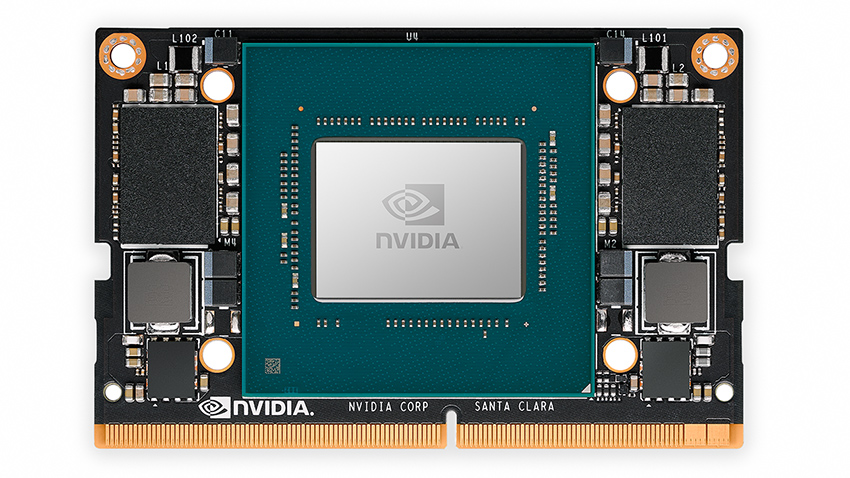

<p align="center"><strong>图 1</strong> Xavier NX 核心模组</p>

核心模组上一般会预先安装好散热模组，散热模组外观如下，尺寸为 58mm（长）× 39mm（宽）× 18mm（厚）：

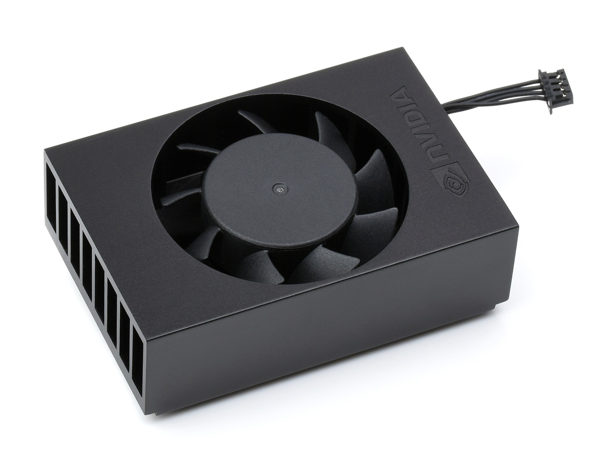

<p align="center"><strong>图 2</strong> Xavier NX 散热模组</p>

核心模组需要搭配载板才是一个完整的计算平台。搭配官方载板组装完成后，外观如下，尺寸为 103mm × 90mm：

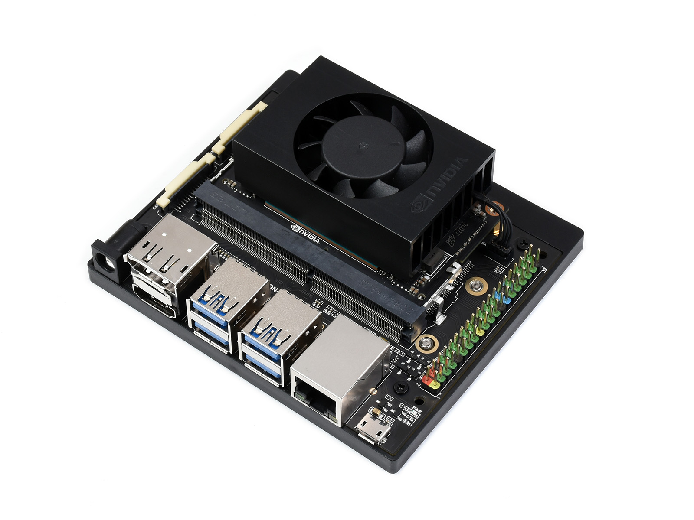

<p align="center"><strong>图 3</strong> Xavier NX 官方载板</p>

背面如下，有一个 2230 长度的 PCIE 网卡接口和一个 2280 长度的 NVMe 协议的 M.2 固态硬盘接口，以及贴片式网卡天线：

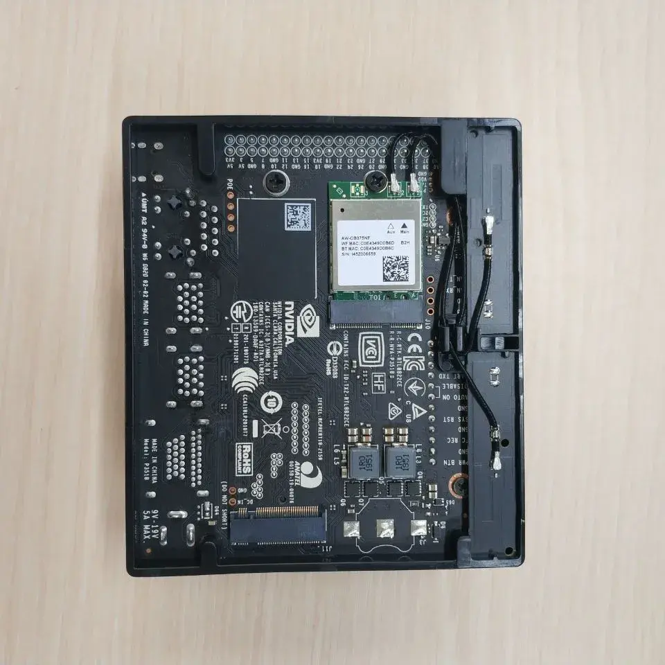

<p align="center"><strong>图 4</strong> Xavier NX 载板背面</p>

**Jetson AGX Xavier**：初代 AGX 规格的 Jetson，体积较大、功耗较高，但性能并不高，不建议在比赛中使用，在此不过多介绍：

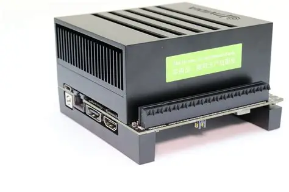

<p align="center"><strong>图 5</strong> Jetson AGX Xavier</p>

#### 1.3 Orin 系列

**Jetson Orin NX**：Jetson Orin NX 是 Jetson Xavier NX 的迭代产品，其模组外观和尺寸等完全一致。Jetson Orin NX 的官方载板可以向下兼容使用 Jetson Xavier NX 的核心模组。与 Xavier 不同的是，Jetson Orin NX 的 8GB 版和 16GB 版的 SoC 规格不同——8GB 版的 CPU 少了两个核，GPU 的运行频率更低，性能降低约 30%。

**Jetson Orin Nano**：初代 Jetson Nano 实际上并不属于 Xavier 系列，其外观、架构和性能与 Jetson Xavier NX 差别很大。而在 Orin 世代，英伟达修改了 Nano 系列的定位——Jetson Orin Nano 本质上是 Jetson Orin NX 的低配阉割版，因此其核心模组的外观和尺寸与 Jetson Orin NX 一致，载板通用。

Orin 系列的 NX 和 Nano 核心模组不再提供 eMMC 硬盘版本，官方的核心模组提供 TF 卡槽，而部分第三方模组可能不提供 TF 卡槽，只能在载板的硬盘里安装系统，如下图所示：

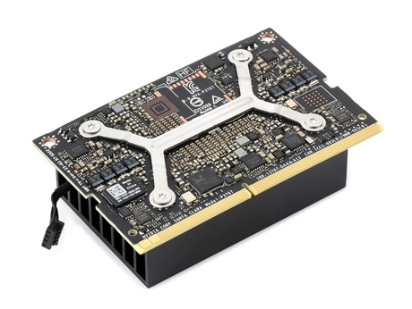

<p align="center"><strong>图 6</strong> Orin 核心模组</p>

Orin 系列的官方载板相比 Xavier 变化不大，最明显的区别是刷机口从 Xavier 的 micro-USB 变为了 Type-C 接口，如下图所示：

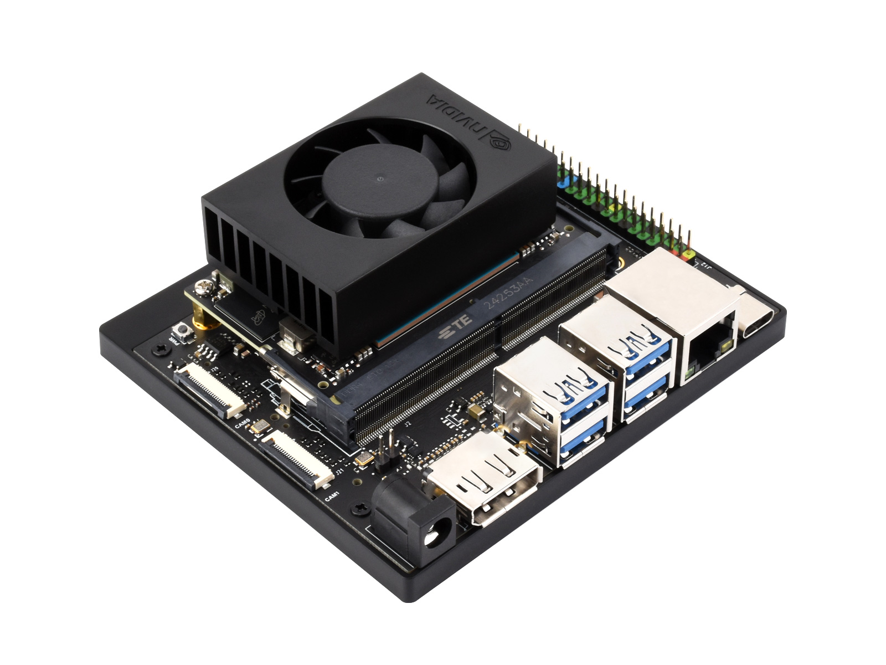

<p align="center"><strong>图 7</strong> Orin 官方载板</p>

**Jetson AGX Orin**：Jetson AGX Orin 是 Jetson AGX Xavier 的迭代产品，其尺寸基本不变，但散热器设计改进、接口布局修改，性能进步极大。但其体积和重量对于 RM 比赛来说仍然偏大偏重，且性价比较低。ARM 芯片的 PCIE 带宽太窄，导致即使使用固态硬盘，其开机速度也和 NX、Nano 一样远远慢于 x86 设备。

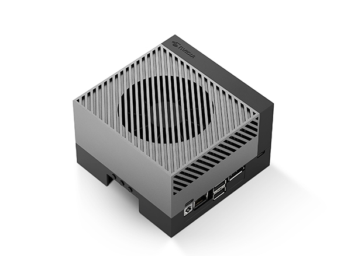

<p align="center"><strong>图 8</strong> Jetson AGX Orin</p>

### 2. 核心模组的选型

具体的规格等详细参数见上面的 Jetson 全系列型号规格参数对比章节。Xavier 系列之前的所有 Jetson，其硬件和软件已经严重落后，已经不再建议采购。特别是初代 Jetson Nano，在搜索时有些商家常常会故意和 Jetson Orin Nano 混在一起——初代 Jetson Nano 发布较晚甚至在 Xavier 系列之后发布，但其规格严重落后，和 Orin 系列的 Nano 差别极大。

#### 2.1 Xavier 系列

Xavier 系列的型号较少，只有 NX 和 AGX 两个型号。NX 的 8GB 版和 16GB 版规格和性能接近，所以根据价格来选合适的即可。但是其性能已经只能和 Orin 系列的 Nano 4GB 版相提并论了，并且其 CPU 架构过于老旧，性能也孱弱，不建议购买。

Xavier 系列的 AGX 性能相比同代的 NX 提升不多，但体积大了很多，重量也重了很多。即使这样，其性能现在已经难以与 Orin 系列的 Nano 相比了，所以极不推荐购买。

整个 Xavier 系列的 JetPack 已经停止更新，并且停留在了 JetPack 5，Ubuntu 版本最高只有 20，CUDA 最高为 11，TensorRT 最高停在了 8，已经无法运行 ROS 2 Humble 和更高版本 CUDA 需求的软件，所以采购需谨慎。

#### 2.2 Orin 系列

Orin 系列的型号较多较杂，有 Nano、NX 和 AGX 三种，并且其不同内存版本的 CPU 和 GPU 规格也存在差异——最低配的 Nano 和最高配的 NX 外观一样，但性能甚至能差出将近 4 倍。

- **Orin Nano**：有 4GB 和 8GB 两个规格。4GB 版本的 CPU 和 8GB 版一致，但 GPU 规格只有一半，导致其 AI 性能也只有 8GB 版的一半，和上代的 NX 性能接近。**推荐 8GB 版**。
- **Orin NX**：有 8GB 版和 16GB 版两个规格。其 GPU 规模一致但频率不同，8GB 版的 CPU 比 16GB 版少两个核，所以性能存在一定差距，根据实际需求和价格选择。
- **Orin AGX**：无论哪个版本的价格都不便宜，性价比并不高。和 x86 设备相比，CPU 性能远远不如；GPU 根据 CUDA 规模可以参考相同规格的电脑独显，比如 AGX Orin 64GB 版的显卡规模接近笔记本版的 RTX 3050，但是频率更低。

### 3. 载板选型

AGX 的价格较高，散热要求高，所以即使和 NX 一样是核心+载板模块化设计，也很少有第三方厂商制作第三代定制载板，在此不多讨论。

真正需要讨论的是 NX 和 Nano。由于 Jetson Xavier NX、Jetson Orin NX、Jetson Orin Nano 的核心模组外观和接口金手指设计完全一致，所以其载板往往是通用的：

- **官方载板**是向下兼容的——Orin 系列的官方载板兼容 Xavier 系列的核心模组，但 Xavier 系列的载板不兼容 Orin 系列的核心模组。
- **第三方载板**如果是仿制官方载板，其兼容性规则与官方载板一致；如果是特殊设计的载板，其兼容性以厂商提供的信息为准。
- 需要注意的是，有些魔改载板可能需要修改 bootloader 才能刷写和正常启动，所以使用第三方载板（尤其是非仿制官方载板的定制载板）时要阅读厂商的使用手册。

**视频接口方面**：Xavier 系列的官方载板上有 DP 和 HDMI 两个视频接口，但是实际上 Xavier 系列只支持 HDMI 输出，DP 口无法使用；Orin 系列的官方载板只有 DP 口，只支持 DP 输出。

### 4. 其他配件的选型

#### 4.1 硬盘

Xavier 系列和 Orin 系列的 Jetson 支持 NVMe 协议的 M.2 接口固态硬盘。注意不要买 NGFF 协议的 M.2 固态硬盘——这两种硬盘外观一样，但协议完全不同。不过现在市面上已经没有全新的 NGFF 硬盘了。

M.2 硬盘根据长度从短到长有 2230、2242 和 2280 三种长度规格：

- 官方载板支持 2280 长度的硬盘，也可以使用 2230、2242 的硬盘通过延长板转接成 2280 规格。
- 有些第三方的特制小尺寸载板可能只支持 2230 或 2242 这种短硬盘，以厂商提供的参数为准。

NVMe 的 M.2 硬盘有 PCIe 1~5 五种速率协议规格。由于 Jetson 的 PCIe 带宽往往很窄，所以即使使用 PCIe 3 的硬盘也很难完全发挥其最高速度，因此不需要为其购置更高速率协议的硬盘。并且 PCIe 4 和 5 的硬盘发热也很严重，所以不推荐给 Jetson 使用。

#### 4.2 无线网卡与天线

Jetson 的无线网卡只支持 2230 的 PCIe 网卡，不同代支持的网卡型号不同——支持 Xavier 系列的网卡不一定支持 Orin 系列，购买时需要询问客服是否支持。

Orin 系列推荐 **RTL8822CE**。

至于天线，官方载板和模仿官方载板的第三方载板往往会设计一个边框一体化天线（即载板路板外边套的那层塑料边框）；其他载板可以根据需要购买笔记本电脑的贴片式天线或台式机的棍状天线。PCIe 网卡的天线接口一般是 IPX4 接口。

#### 4.3 电源

官方载板和第三方仿制载板的电源接口是笔记本通用的 DC5525（即外径 5.5mm，内径 2.5mm 的 DC 电源接口，现在只有神舟或机械革命还在用了）。官方载板支持输入 5~19V 电压均可开机，仿制板一般也支持这个输入电压范围，不过有些仿制载板只支持 12V 不支持更高电压，使用前需要阅读该载板的手册。

有些特制载板使用 XT30 接口，支持 24V 输入电压。总之使用第三方载板时一定要阅读厂商给的手册。

装到车上时，由于车只能提供 XT30 接口的 24V 电，所以需要一个**降压模块**，实现 XT30 的 24V 转接为 19V 或 12V。注意事项：

- 降压模块一般不包括接口，输入输出只有裸线，需要电控或硬件焊接。
- 购买降压模块时需要特别注意**输出的最大电流**，需要根据小电脑的功耗选择。
- 降压的输出电压是恒定的，输出电流是随电脑需要动态变化的，但是不会超过最大电流。所以一定要注意降压模块的最高输出功率只能比小电脑的最大功耗高，不能低，否则会出现高负载运行时功率不足、系统自动断电的问题。

一般 NX、Nano 开启 Super 模式的 MAXN 模式时最高功率不会超过 30W，所以输出 19V 3A 的降压模块够用了；AGX 则需要 19V 4A 的降压模块。

## Jetson 开发板刷机前准备

> 在正式开始刷机之前，需要先完成以下准备工作。

### 1. 主机安装特定版本的 Ubuntu 系统

主机需要安装特定版本的 Ubuntu（实体机或虚拟机皆可）。由于 JetPack 不同大版本绑定不同大版本的 Ubuntu，因此需根据要刷的 JetPack 版本选择刷机端对应的 Ubuntu 版本，否则可能出现 SDK Manager 无法下载所需 JetPack 的情况。

**兼容性规则**：SDK Manager 的版本判定**向上兼容**——低版本的主机 Ubuntu 允许给 Jetson 下载和刷写与主机相同或更高 Ubuntu 版本的 JetPack，但**不会向下兼容**，即主机无法给 Jetson 下载和刷写比主机 Ubuntu 版本更低的 JetPack。例如：

- 主机 Ubuntu 20 → 可刷 JetPack 5（Ubuntu 20）和 JetPack 6（Ubuntu 22）
- 主机 Ubuntu 22 → 只能刷 JetPack 6

> **建议：** 不要跨 Ubuntu 大版本刷机，要刷什么版本的 Ubuntu，主机就使用什么版本的 Ubuntu。

**实体机 vs 虚拟机**：过去 SDK Manager 只能在 Linux 环境下使用，因此许多教程会先教如何在 Windows 中安装 Linux 虚拟机。但**强烈建议使用实体机 Linux 进行刷机**，因为虚拟机的 USB 驱动极不可靠。近期 NVIDIA 官方推出了 Windows 版 SDK Manager，但截至本文编写完成时，Windows 版尚不能对 Jetson 进行刷机和安装库，因此本文仍使用实体机 Linux 环境完成刷机。

#### JetPack 版本与核心组件绑定关系

更早的 JetPack 版本冗杂且老旧，这里只列举 JetPack 4 及以后的版本的绑定情况。

| JetPack 版本 | Ubuntu 版本 | CUDA 版本 | TensorRT 版本 | 支持的 Jetson 系列           |
| :----------- | :---------- | :-------- | :------------ | :--------------------------- |
| **4.x**      | 18.04       | 10.x      | 8.x           | 早期架构（TX2/Nano）+ Xavier |
| **5.x**      | 20.04       | 11.x      | 8.x           | Xavier + Orin                |
| **6.x**      | 22.04       | 12.x      | 10.x          | Orin 系列（含 Nano/NX/AGX）  |
| **7.x**      | 24.04       | 13.x      | 10.x          | Thor 系列（T4000/T5000）     |

> **说明：**
> - **4.x** 是最后一个支持**早期架构系列**（如 TX2、Nano）和 **Xavier** 的大版本，之后 5.x 也支持 Xavier，但 6.x 及以后不再支持。
> - **5.x** 是 Xavier 与 Orin 的过渡版本，后续 Orin 系列主要在 6.x 及之后发展。
> - **6.x** 仅支持 Orin 系列（Ampere 架构），不再支持 Xavier。
> - **7.x** 专为 Thor（Blackwell）设计，不向下兼容。
> - 同一大版本内（如 5.0.x → 5.1.x）CUDA 和 TensorRT 的大版本通常保持不变，仅小版本更新。

---

### 2. 预留较大的剩余磁盘空间

刷机包和各种库会在主机端解压展开，空间占用很大。一个完整展开的 JetPack 6.2 大约占用 **80 GB**，文件主要位于 `~/Downloads/nvidia` 和主目录下的 `nvidia` 文件夹中。

- **刷完可手动删除**这些文件，但下次刷机需重新下载展开。
- **不删除则下次刷机可直接使用**，但需**记住本次刷机的 JetPack 具体版本**。克隆或救砖重新刷写底层时，需要下载与硬盘/TF 卡上相同的 JetPack 版本，而非 SDK Manager 默认提供的最新版，否则可能出现无法正常开机、网卡驱动无法加载、CUDA 无法调用等问题。

### 3. 注册 NVIDIA 开发者账号

下载 SDK Manager、cuDNN、TensorRT 等 NVIDIA 开发组件均需要 NVIDIA 账号。前往 [NVIDIA Developer 官网](https://developer.nvidia.com/) 用邮箱注册一个即可（网络卡顿可尝试开启代理）。

### 4. 下载并安装 SDK Manager

下载地址：[SDK Manager | NVIDIA Developer](https://developer.nvidia.com/sdk-manager#installation_get_started)

下载好 deb 版的 SDK Manager 包，使用 `dpkg` 安装，命令如下，安装后打开软件，登录Nvidia账号即可进入软件主页：

```bash
# 文件名以实际下载的为准
sudo dpkg -i sdkmanager_2.3.0-12617_amd64.deb
```

## Jetson 开发板刷机流程

> Jetson 刷机分为两个阶段：
> 1. **刷固件阶段** — Jetson 在 APX 模式下，电脑将底层引导和系统文件刷写进开发板。
> 2. **刷软件阶段** — 开发板重启进入系统后（L4T 模式），电脑将 CUDA、TensorRT、OpenCV 等组件传入并自动安装。

本教程以 Orin Nano 安装 JetPack 6 为例，Orin 其他型号和 Xavier 系列的 Jetson 操作方法基本一致。

---

#### Step 1 — 使 Jetson 进入 APX 模式

Jetson 使用的 Tegra 芯片与手机芯片类似，也有其"刷机救砖"模式。NVIDIA 给 Jetson 的刷机方式是进入 **APX 模式**（类似于高通芯片的 9008 模式和联发科芯片的 SP 深刷模式），连接电脑使用 SDK Manager 进行刷机操作。

首先将开发板关机，准备好电源，接上显示器以随时观察刷机进度，然后根据不同 Jetson 和载板执行以下操作进入 APX 模式：

**▎无物理按键的官方载板 / 第三方仿官方载板**

一般官方载板或仿制官方载板的 NX/Nano 没有快捷进入 APX 模式的按键，需要短接载板上的脚位：

1. 保持**断电**状态。
2. 使用杜邦线**短接 `FC REC` 和 `GND`** 脚位（核心模组下面那排横向排针，在接口朝左放置开发板时，从上到下数第 3 和第 4 个针，如下图所示）。
3. 给开发板通电并接上屏幕（APX 模式下为黑屏，接屏幕是为了后续观察刷机进度）。

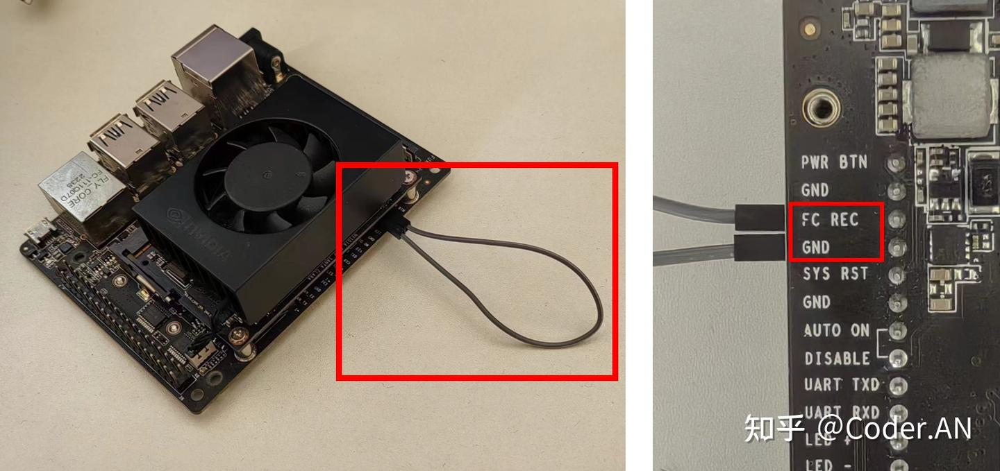

<p align="center"><strong>图 9</strong> 短接脚位示意图</p>

**▎AGX Orin 等带物理按键的载板**

1. 断开电源。
2. 按住 **RECOVERY**（强制恢复）按钮（或 FORCE RECOVERY 键）。
3. 按住 **RESET**（重置）按钮，保持 2 秒后松开 RESET。
4. 继续保持按住 RECOVERY 按钮 2 秒后松开。

**▎验证是否进入 APX 模式**

进入 APX 模式的开发板连接屏幕为黑屏。此时：

1. 打开主机的 SDK Manager。
2. 用 USB 线连接 Jetson 载板的 USB Type-C / microUSB 接口（由载板类型决定）到主机。
3. 软件会自动识别 Jetson 型号并提示 **APX mode**，说明已成功进入 APX 模式。

> 注意：部分使用第三方载板的 Jetson 可能会弹出类型选择窗口（如下图），随便选一个即可。

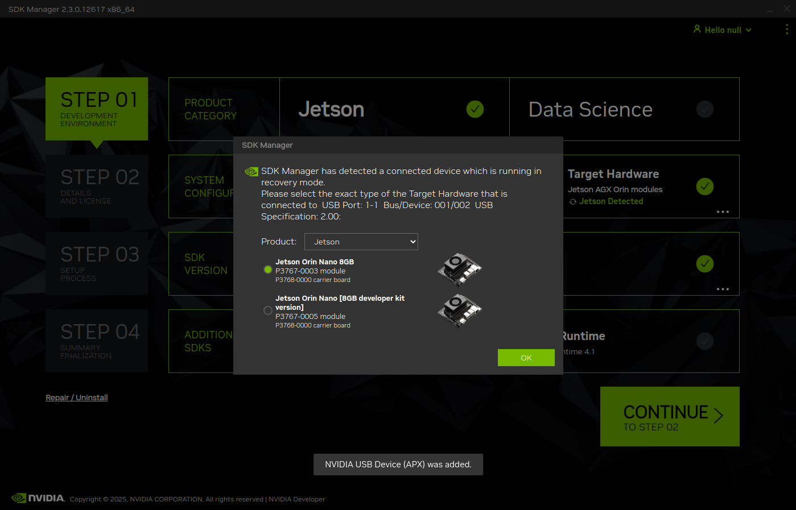

<p align="center"><strong>图 10</strong> 类型选择窗口</p>

#### Step 2 — 选择并下载系统固件与软件库

在 SDK Manager 首页（STEP 1）进行初始设置：

1.  **不要勾选** `Data Science`。
2.  **不要勾选** `Host Machine`（往主机安装相同组件只会浪费空间）。
3. `Target Hardware` 会自动显示 Jetson 型号，一般无需手动修改。
4. 选择 **JetPack 版本**：
   - 默认选中最新版；点击下拉菜单可查看所有支持的 JetPack 版本（如图 11）。
   - 已下载的版本会显示 `installed` 字样，可直接使用。
   -  **务必记住本次刷机的 JetPack 具体版本**——克隆或救砖时，主机端数据必须与 Jetson 硬盘上的 JetPack 版本一致，否则可能出现无法开机、网卡驱动无法加载、CUDA 无法调用等问题。
5. 其余组件（如 DeepStream、GXF Runtime）**不需要**勾选，最终选择参考图 12。
6. 点击 **Continue** 进入 STEP 2。

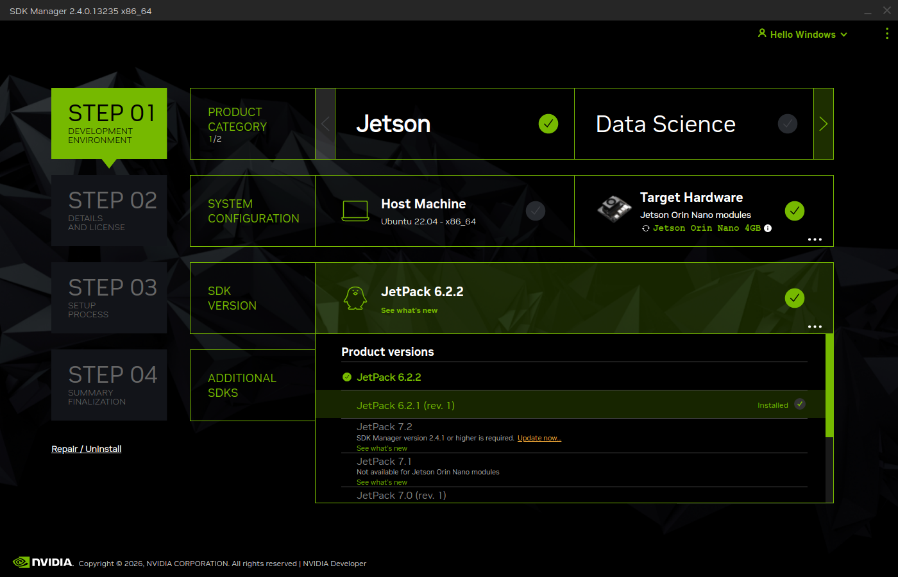

<p align="center"><strong>图 11</strong> JetPack 版本选择</p>

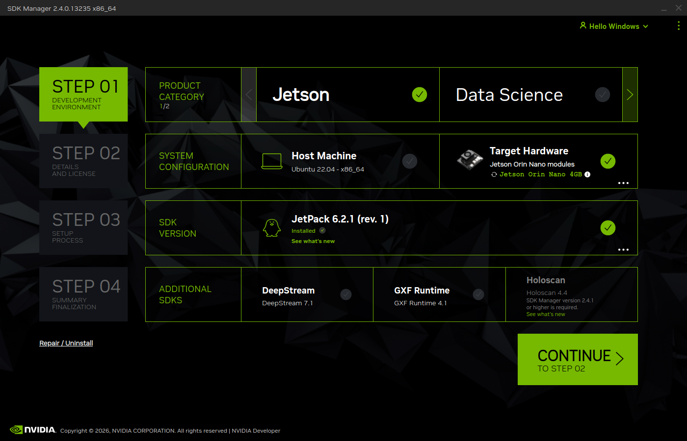

<p align="center"><strong>图 12</strong> STEP 1 最终选择参考</p>

在 STEP 2 中选择要下载安装的组件（共四大类）：

| 组件 | 说明 | 建议 |
|:---|:---|:---:|
| **Jetson Linux** | Ubuntu 系统镜像 + 刷机脚本。仅需最小系统时可只勾此项 | 必选 |
| **Jetson Runtime Components** | CUDA、TensorRT 等组件的**运行时库**（已编译程序依赖） | 建议勾选 |
| **Jetson SDK Components** | 开发组件库（编译 CUDA/TensorRT 程序时需要）。**务必与 Runtime 同时勾选**，否则编译 CUDA 版 OpenCV 时会找不到 CUDA | 建议勾选 |
| **Jetson Platform Services** | 附加服务组件 | 建议勾选 |

> **注意：** 很多教程只勾选了 Runtime Components，导致编译 CUDA 版 OpenCV 时找不到 CUDA。由于 JetPack 的 CUDA/TRT 版本捆绑特性，**建议全部勾选**。

接着可以修改下载安装位置（**不建议修改**），在最下方勾选接受用户协议，最终选择应与图 13 一致。

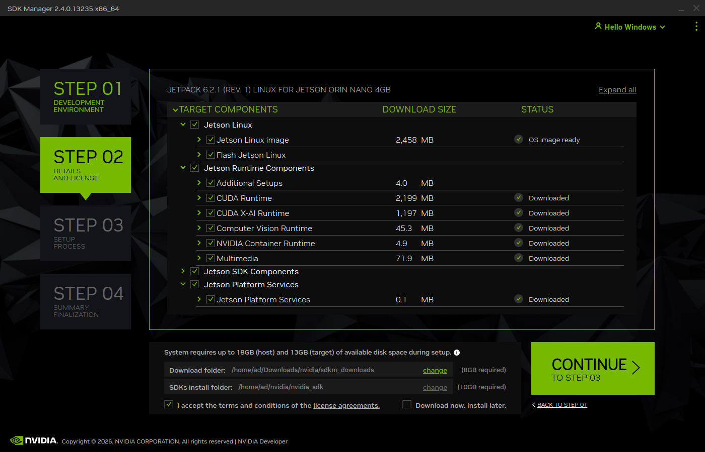

<p align="center"><strong>图 13</strong> STEP 2 最终选择参考</p>

#### Step 3 — 刷写系统

刷写系统有两种方法，它们在刷固件阶段操作不同，但后续刷入软件库的步骤基本一致。

>  使用 SDK Manager 刷机虽然方便，但存在两个问题：
> 1. 给 Orin 系列刷机时**无法启用 Super 模式**解锁 MaxN 功耗挡。
> 2. 部分定制载板魔改了设备树（如硬盘映射与官方不同），SDK Manager 无法处理，需手动修改配置文件刷机。

---

##### 方法 A：使用 SDK Manager 图形化刷机

适合不需要 Super 模式、使用官方或仿官方载板的场景。

1. 在 STEP 2 中 **不要勾选** `Download Now Install Later`，这样下载完成后会直接进入刷机流程。
2. 点击 **Continue** 进入 STEP 3，开始下载（如图 14）。

   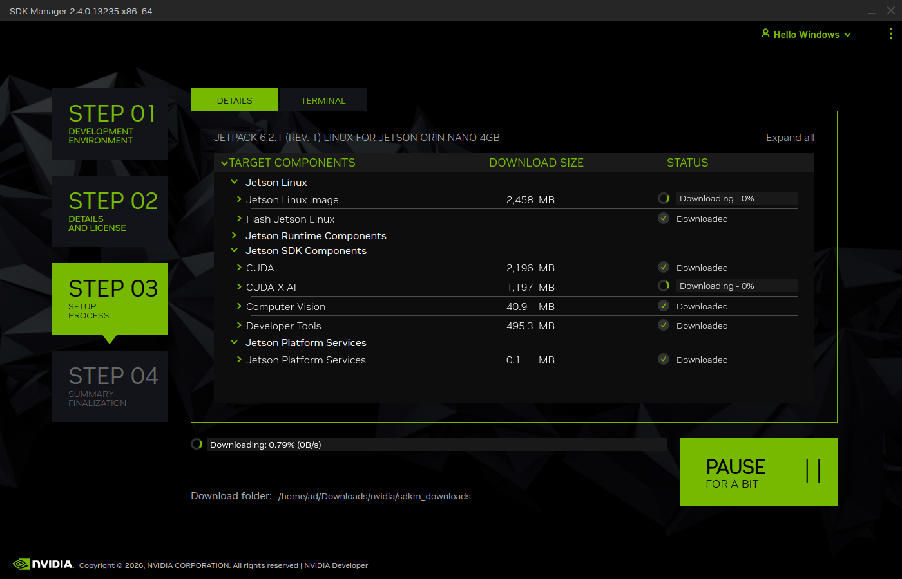

   <p align="center"><strong>图 14</strong> 开始下载</p>

3. 下载展开完成后会弹出刷机配置窗口（如图 15）：
   - **Device** — 保持自动即可。
   - **OEM Configuration** — 建议使用默认的 `Pre-Config`。
   - **Username / Password** — 设置新系统的账户和密码（本文统一使用 `horizon` / `1`）。
   - **Storage Device** — **强烈建议直接选择 NVMe**，不要先刷到 eMMC/TF 卡再"迁移"到 NVMe。

   > **为什么不能先刷到 eMMC/TF 再迁移？**
   > 这种"迁移"本质不完整——系统的引导和底层仍在 TF 卡或 eMMC 里。每次开机先通过 TF/eMMC 引导进入硬盘系统，一旦 TF/eMMC 数据变化或更换硬盘，系统就无法进入，且开机速度远慢于直连 NVMe 安装。Orin 世代很多型号甚至没有自带的 TF 卡槽或 eMMC，也只能选择 NVMe。

   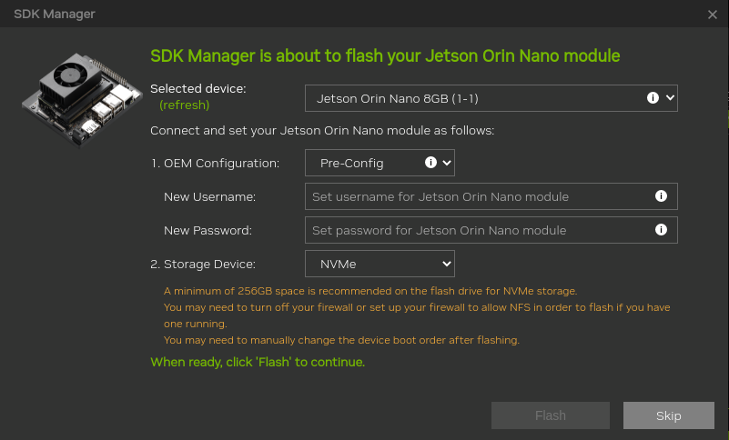

   <p align="center"><strong>图 15</strong> 刷机配置窗口</p>

4. 点击 **Flash** 开始刷机。当第一行 `Jetson Linux` 安装完成后，Jetson 自动重启进入系统，SDK Manager 弹出新弹窗，说明完成"刷固件"阶段，进入"刷软件"阶段。

---

##### 方法 B：命令模式手动刷机（推荐，可启用 Super 模式）

适用于需要启用 Super 模式或使用定制载板的场景。

1. 在 STEP 2 中 **勾选** `Download Now Install Later`，点击 Continue 后只会下载所有组件，不会自动安装。
2. 等待所有组件下载完成，提示完成后点击 **Finish** 退出 SDK Manager（如图 16）。

   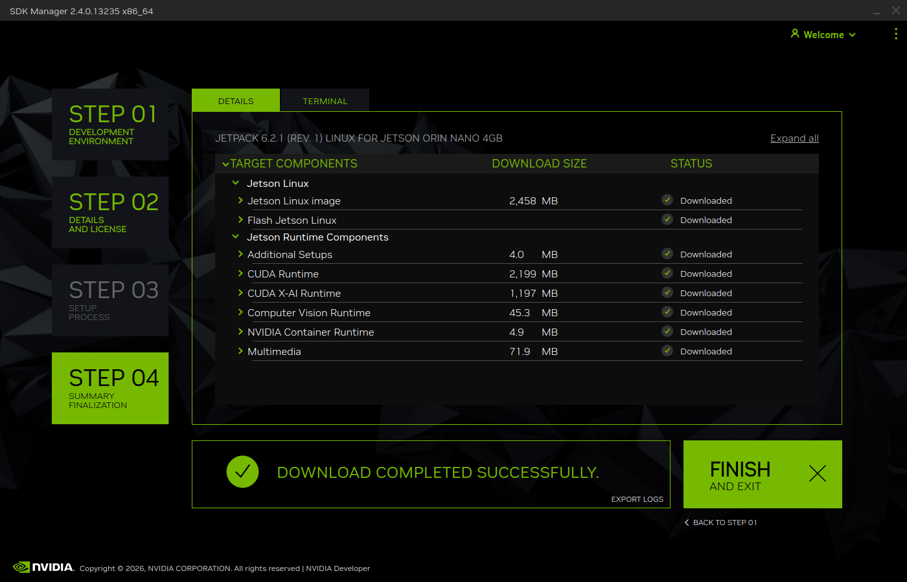

   <p align="center"><strong>图 16</strong> 下载完成</p>

3. 从文件管理器里进入刷机文件目录（未修改下载位置时）：

   ```bash
   一般在主文件夹/nvidia/nvidia_sdk/JetPack_6.x.x_Linux_JETSON_XXX_XXX_TARGETS/Linux_for_Tegra
   ```

   > 路径中的 `xxx` 为具体版本和型号，不同版本和设备有所不同。

   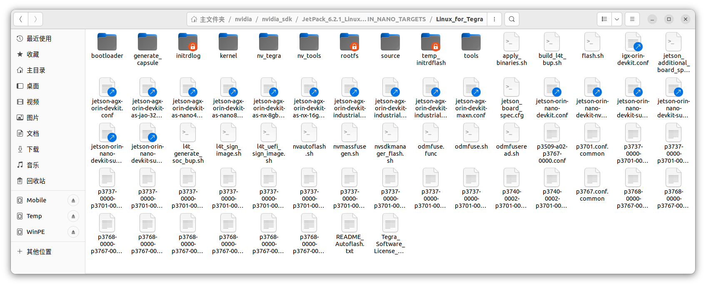

   <p align="center"><strong>图 17</strong> `Linux_for_Tegra` 目录内容</p>

4. 该目录下存在多个 `.conf` 配置文件，对应不同刷机配置：
   - 含`super` 字样 → 启用 Super 模式的配置文件。
   -  含`nvme` 字样→ 刷系统到 NVMe 硬盘。

5. 以 Jetson Orin Nano 启用 Super 模式并安装系统到 NVMe 为例，在该目录下执行：

   ```bash
   sudo ./tools/kernel_flash/l4t_initrd_flash.sh \
       --external-device nvme0n1p1 \
       -c tools/kernel_flash/flash_l4t_t234_nvme.xml \
       -p "-c bootloader/generic/cfg/flash_t234_qspi.xml" \
       --showlogs --network usb0 \
       jetson-orin-nano-devkit-super internal
   ```

   > 期间不要做其他操作，等待自动完成。

6. 终端出现如下提示即说明刷机完成（如图 18）：

   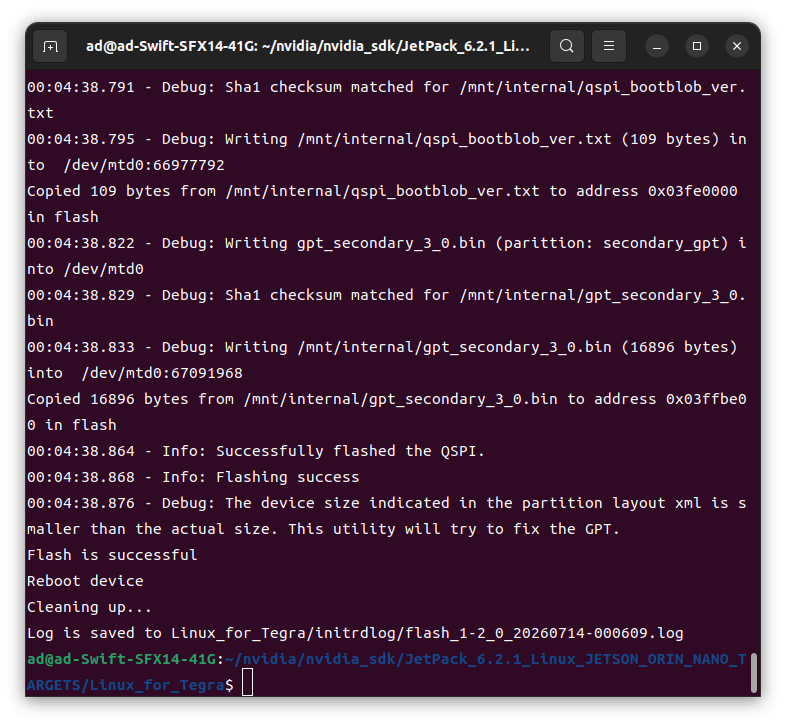

   <p align="center"><strong>图 18</strong> 刷机完成提示</p>

7. Jetson 自动重启进入系统（如图 19）：

   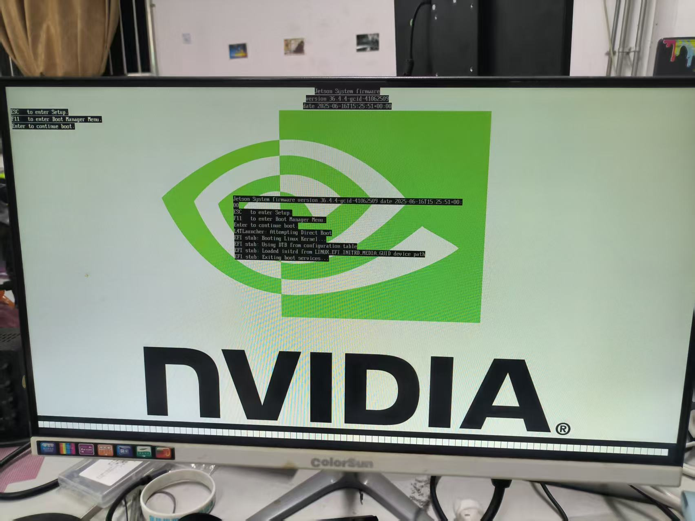

   <p align="center"><strong>图 19</strong> 系统启动</p>

8. 与 SDK Manager 刷机不同，命令刷机未提前设置账户，首次进入系统时会进入 Ubuntu 初始化设置流程：

   - **语言设置** — 选择 **English**（如图 20~21）。

     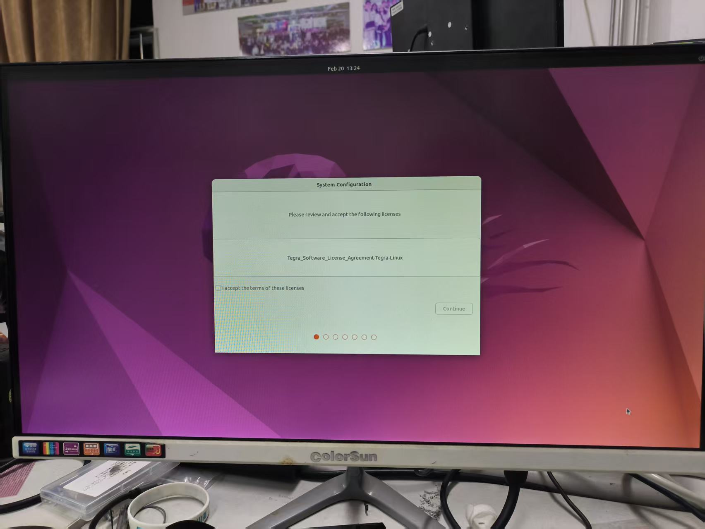

     <p align="center"><strong>图 20</strong> 初始化欢迎界面</p>

     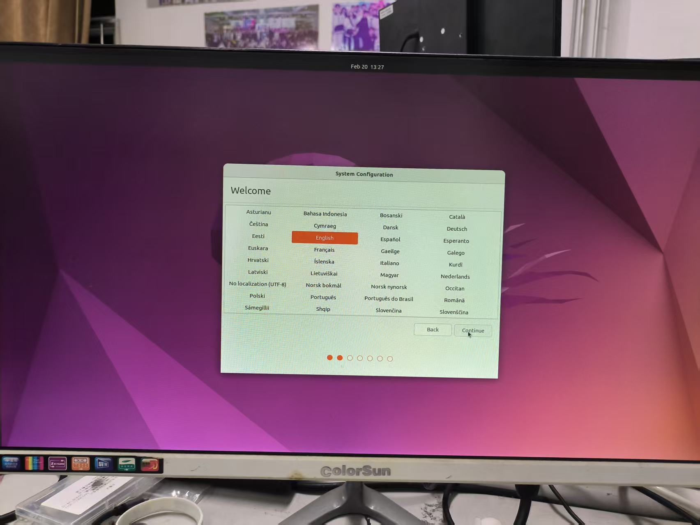

     <p align="center"><strong>图 21</strong> 语言选择（保持英文）</p>

   - **联网设置** — 可在此连接 Wi-Fi（需与主机同一网络），也可跳过，进入系统后"刷软件"前再设置（如图 22）。

     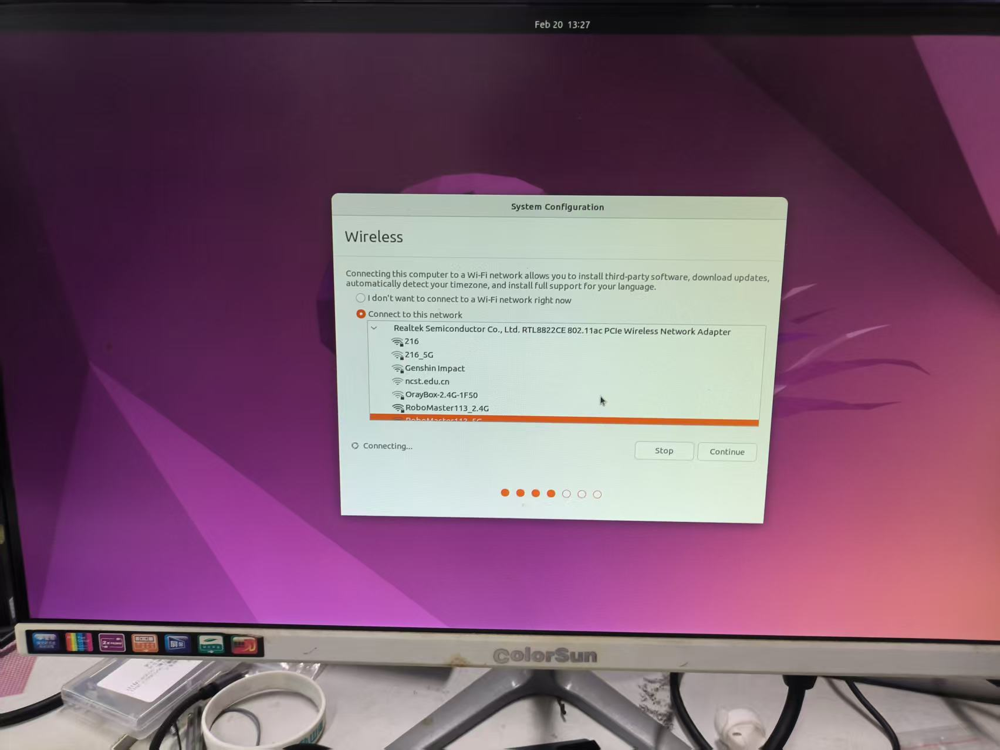

     <p align="center"><strong>图 22</strong> 联网设置</p>

   - **账户设置** — 用户名设为 `horizon`，密码设为 `1`，记得**启用自动登录**（如图 23）。

     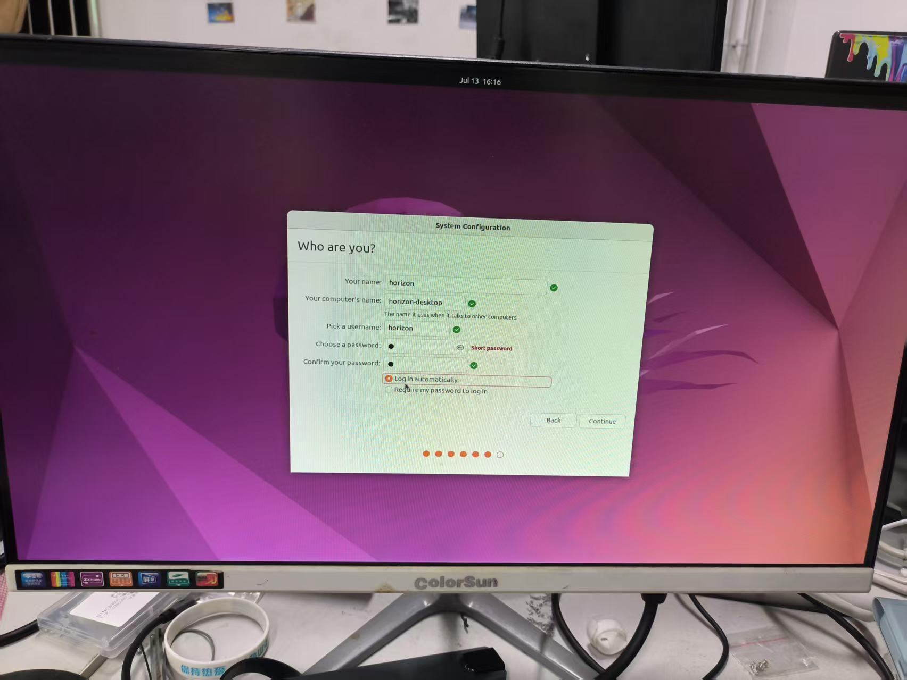

     <p align="center"><strong>图 23</strong> 账户设置</p>

   - **是否安装谷歌浏览器** — 选择 **否**（如图 24）。Ubuntu 的 snap 自动更新导致基于 snap 的浏览器无法正常打开，需降级 snap 后重装，详见后文解决方法。

     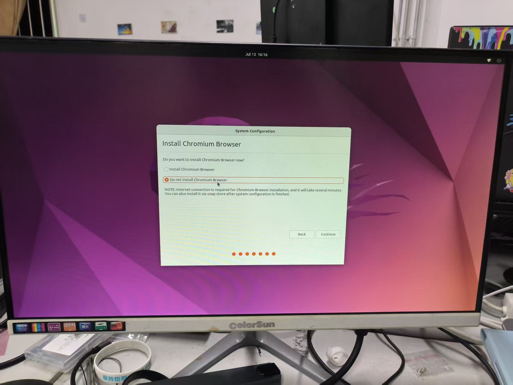

     <p align="center"><strong>图 24</strong> 浏览器安装询问</p>

9. 设置完成后再次自动重启，进入桌面。此时右上角功耗选择栏中可见 **MAXN SUPER** 模式，说明成功刷入 Super 模式系统（如图 25）。

   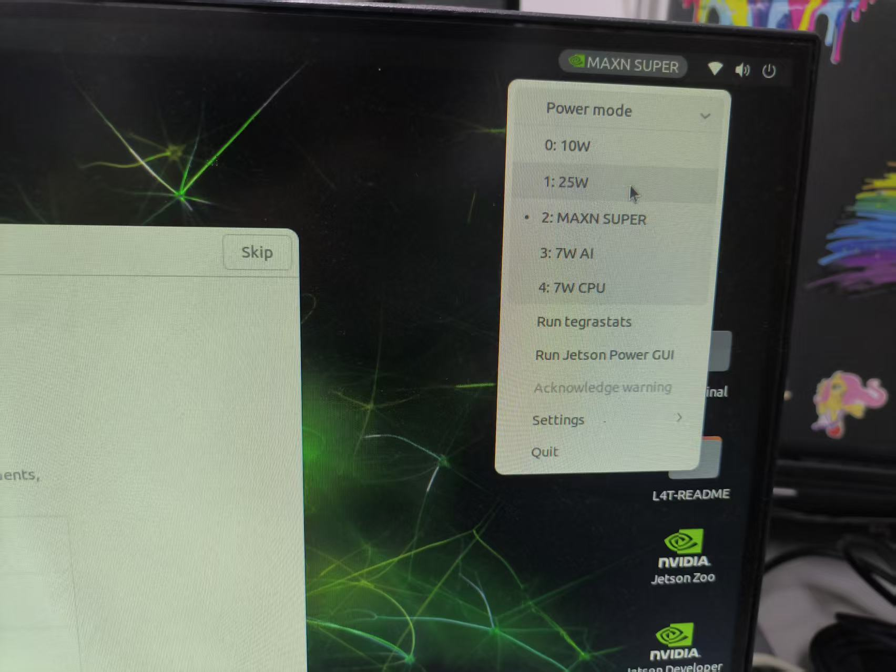

   <p align="center"><strong>图 25</strong> Super 模式确认</p>

10. 完成"刷固件"阶段，进入"刷软件"阶段。

#### Step 4 — 刷入软件库

> 无论使用哪种刷固件方法（方法 A 或 B），刷入软件库的操作基本一致。

完成刷固件后，Jetson 与主机的连接从 **APX 模式**切换为 **L4T 模式**（拔插连接线后 SDK Manager 会显示 L4T 连接，如图 26），文件资源管理器中会出现名为 `L4T README` 的移动设备（如图 27）。

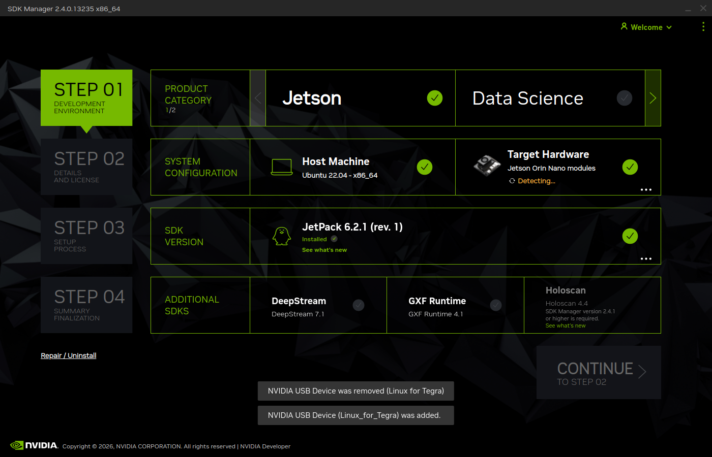

<p align="center"><strong>图 26</strong> L4T 连接状态</p>

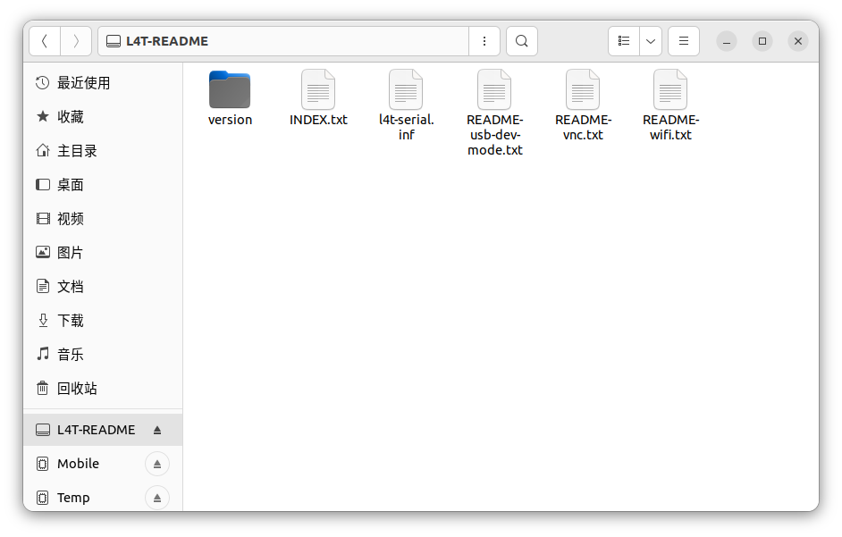

<p align="center"><strong>图 27</strong> L4T README 设备</p>

##### Jetson 端设置

先不要操作主机，在 Jetson 上完成以下准备：

1. **连接 Wi-Fi** — 与主机连入同一网络（如图 28）。

   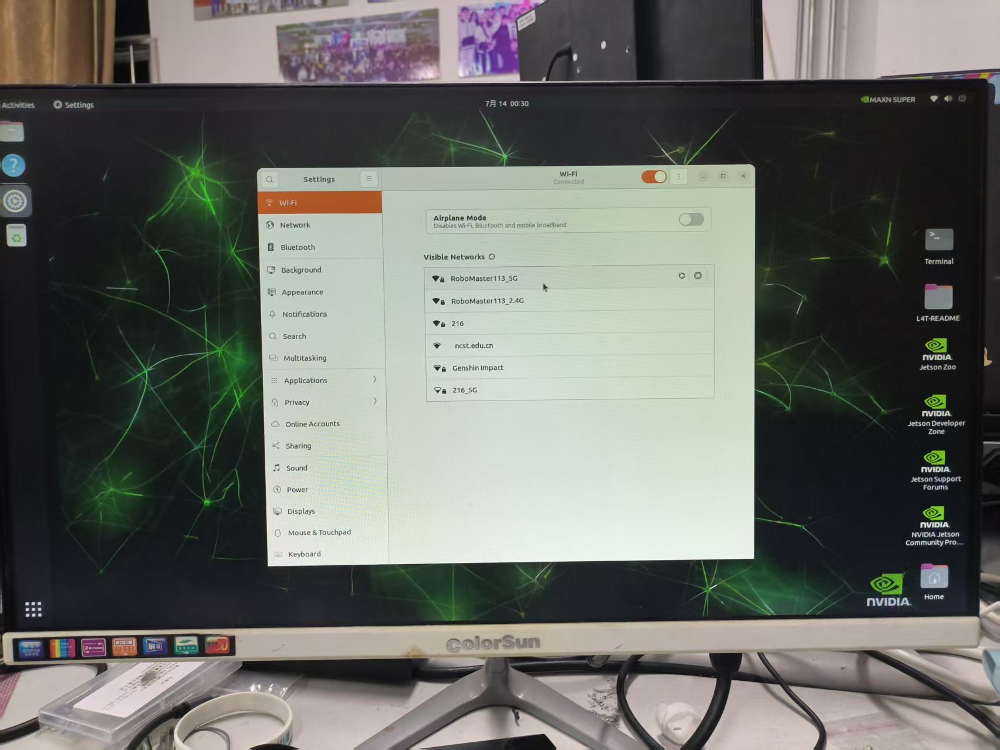

   <p align="center"><strong>图 28</strong> 连接 Wi-Fi</p>

2. **关闭自动休眠** — 防止长时间静止导致自动休眠，需修改两处设置（如图 29~30）：

   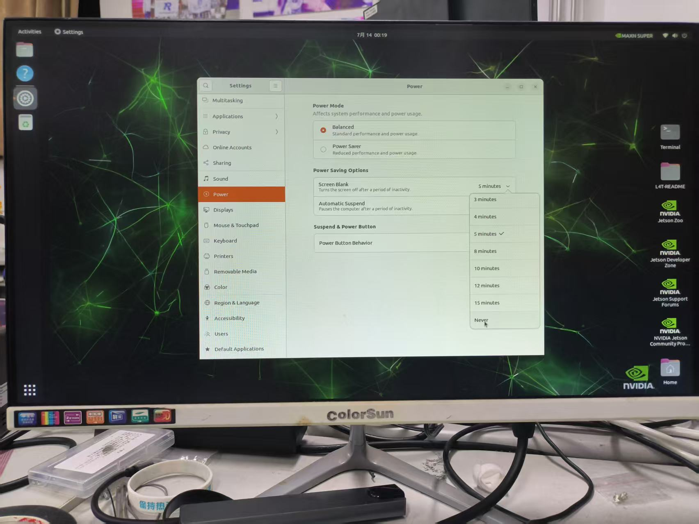

   <p align="center"><strong>图 29</strong> 关闭息屏设置</p>

   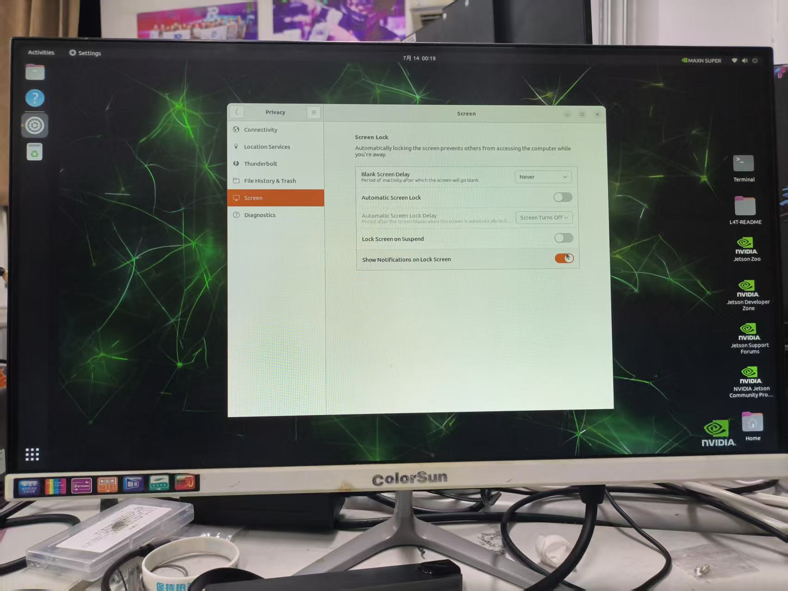

   <p align="center"><strong>图 30</strong> 关闭自动休眠设置</p>

##### 主机端设置

**情况一：刷固件使用 SDK Manager（方法 A）**

SDK Manager 应已弹出弹窗（如图 31），输入**主机密码**。

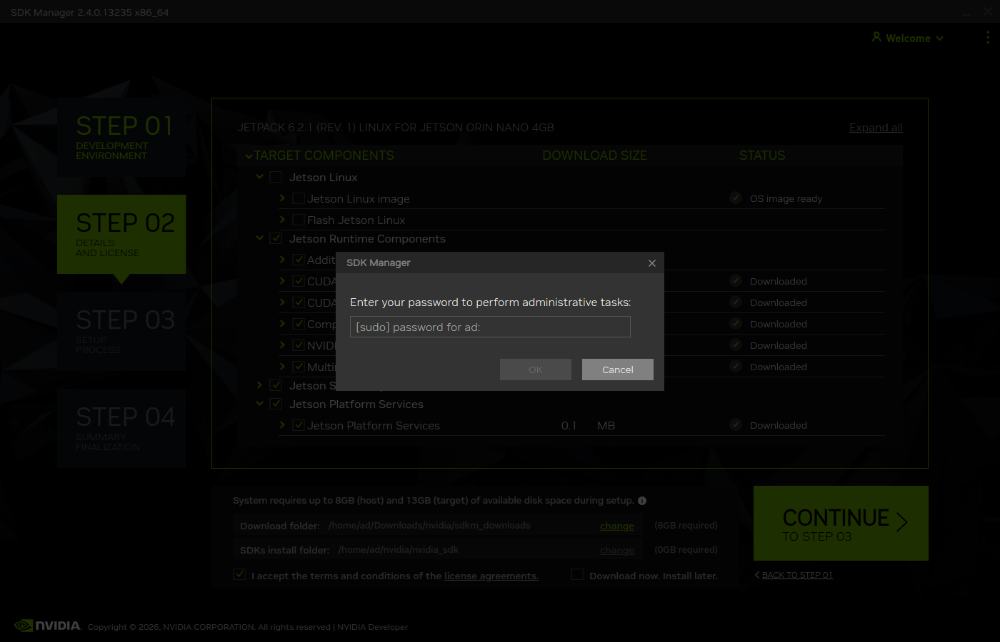

<p align="center"><strong>图 31</strong> 输入主机密码</p>

**情况二：刷固件使用命令模式（方法 B）**

重新打开 SDK Manager：

1. 在 STEP 1 中**仔细重新选择**所有选项（SDK Manager 不会记忆上一次设置），尤其是 JetPack 版本。
2. 进入 STEP 2，注意： **不要勾选 Jetson Linux**（否则会覆盖 Super 模式系统），其余组件**全部勾选**，且不要勾选 `Download Now Install Later`（如图 32）。

   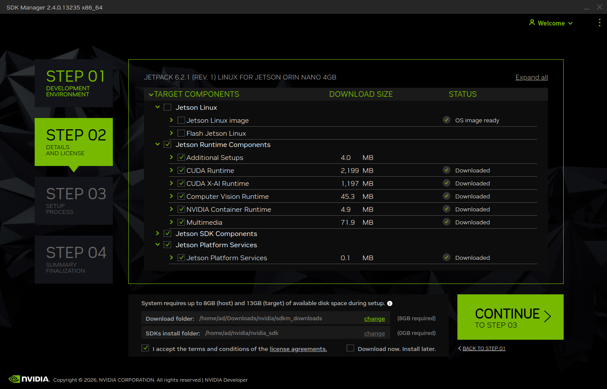

   <p align="center"><strong>图 32</strong> 命令刷机后的 STEP 2 选择</p>

3. 点击 Continue 进入 STEP 3，弹出与情况一相同的密码输入窗口（如图 33）。

   

   <p align="center"><strong>图 33</strong> 输入主机密码</p>

---

**两种情况的后续步骤一致：**

4. 输入主机密码后弹出连接配置窗口（如图 32 / 图 34）。此处设置软件写入的连接方式，需要 Jetson 的 sudo 权限，填写 **Jetson 系统的账号和密码**，其余选项保持默认（如图 35）。

   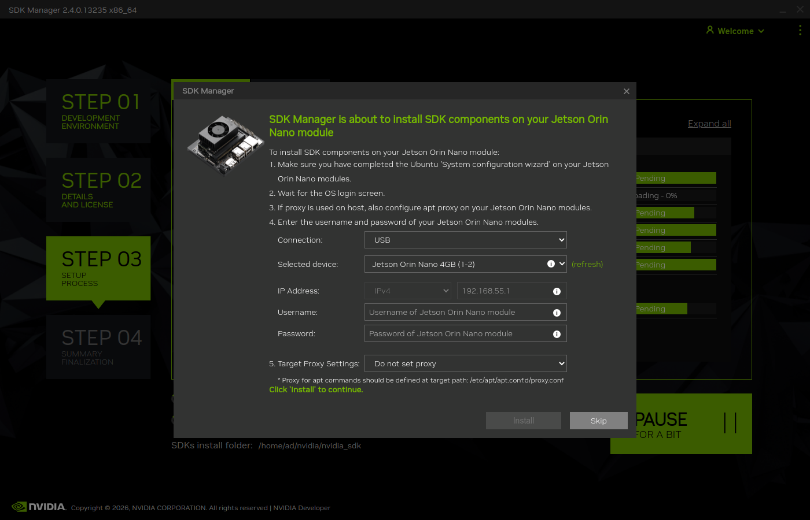

   <p align="center"><strong>图 34</strong> 连接配置窗口</p>

   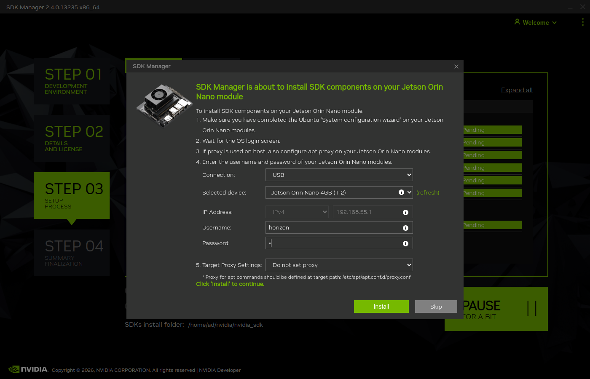

   <p align="center"><strong>图 35</strong> 填写 Jetson 账户信息</p>

5. 点击 **Install**，弹出检查窗口，对主机和 Jetson 进行以下检查：
   - 磁盘空间
   - 网络连接
   - APT 命令可用性
   - 系统和软件版本对应关系

   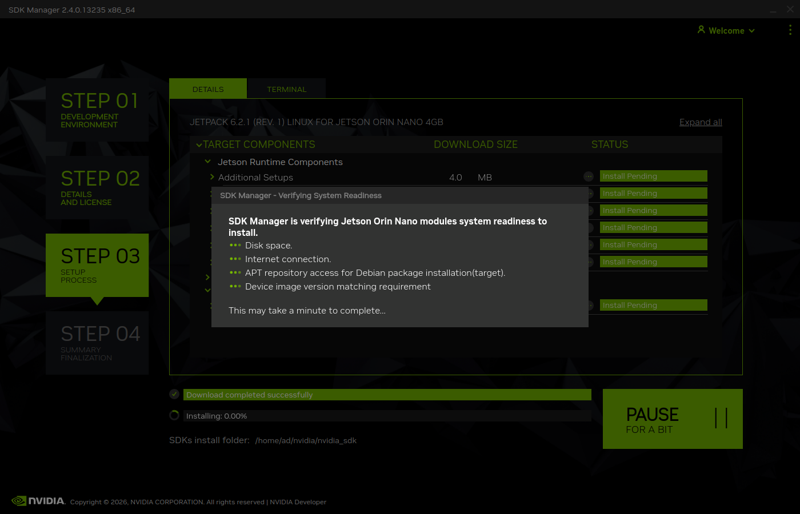

   <p align="center"><strong>图 36</strong> 环境检查</p>

6. 检查通过后开始自动安装软件。默认显示 **DETAILS** 视图，展示各组件安装进度（如图 37）；点击 **TERMINAL** 可切换到终端日志（如图 38）。

   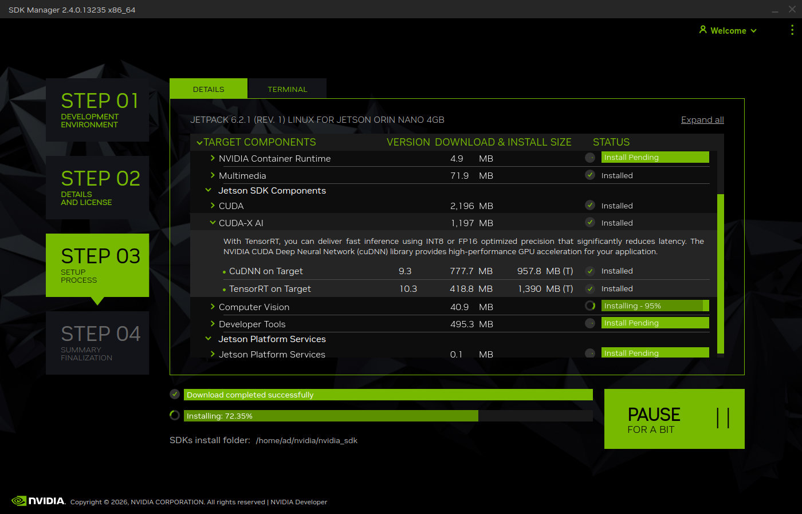

   <p align="center"><strong>图 37</strong> 安装进度（DETAILS）</p>

   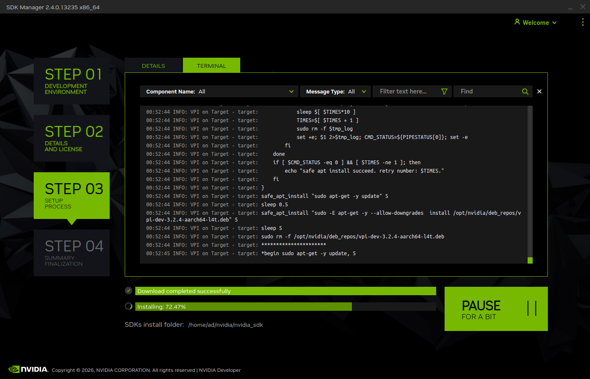

   <p align="center"><strong>图 38</strong> 终端日志（TERMINAL）</p>

7. 等待安装完成（通过 USB 传输数据 + 网络下载组件，耗时较长）。安装完成后如图 39 所示，此时"刷软件"阶段完成，**刷机全部结束**

   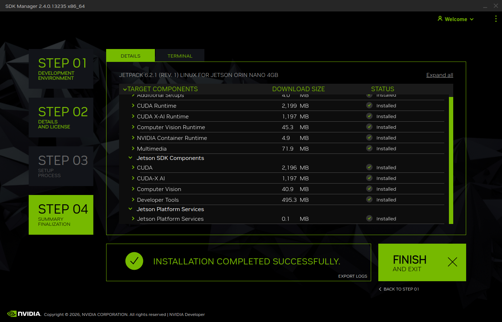

   <p align="center"><strong>图 39</strong> 刷机完成</p>

## 软件环境配置

刷机完成后，Jetson 系统已安装 CUDA、CUDNN、TensorRT、OpenCV（非 CUDA 扩展版）、Docker（Jetson 版）等组件，但还需进行以下设置。

#### 1. 更换软件源、修改语言、安装浏览器

##### （1）换源

见我的另一篇文章：《 Jetson 更换软件源教程 》

##### （2）修改系统语言为中文

刷系统时由于未联网且未换源，即使在 OOBE 界面选择中文，也会因语言包缺失而仍显示英文，因此刷机教程中 OOBE 步骤选择了英文。在更换国内软件源后，打开 Language Support，

在弹出的窗口里选“Install”，如下图 40

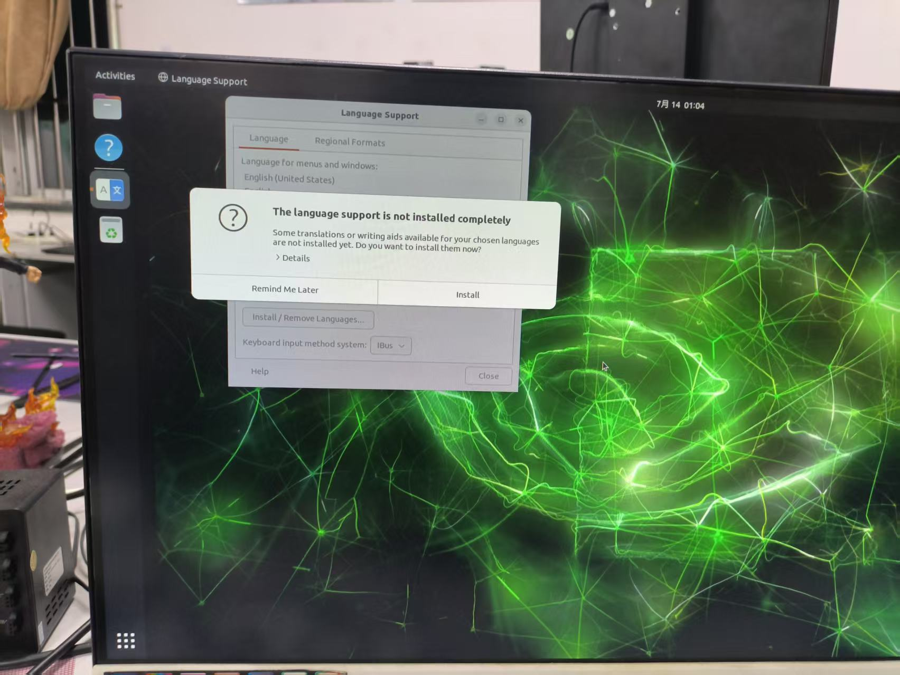

<p align="center"><strong>图 40</strong> 语言支持</p>

然后会下载缺失的中文语言包，如图 41 所示

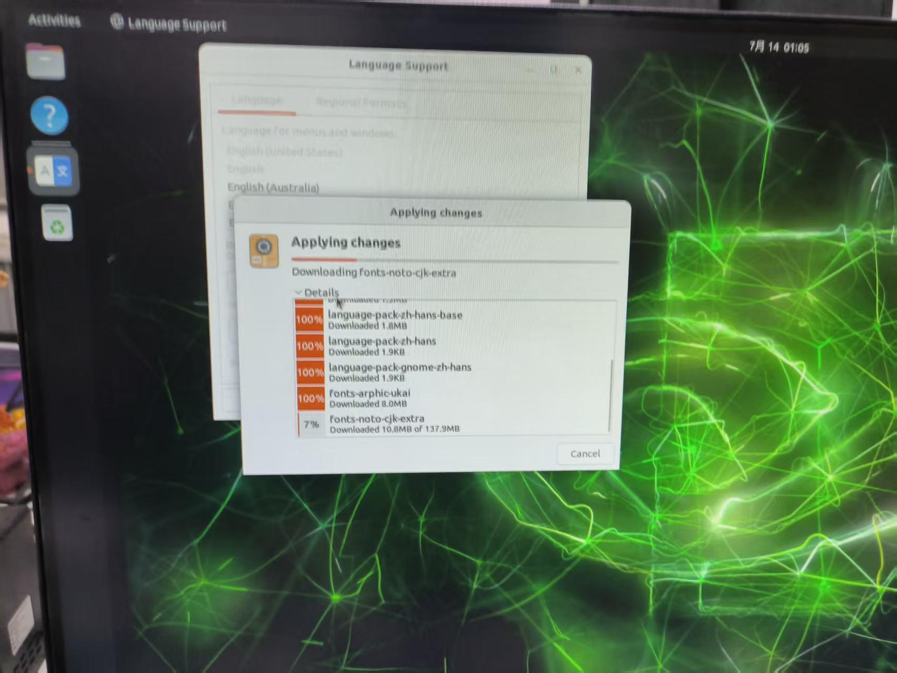

<p align="center"><strong>图 41</strong> 下载语言包</p>

接着在此窗口里拖动“Chinese”到第一行（如图 42），即可修改系统为中文系统，重启生效。

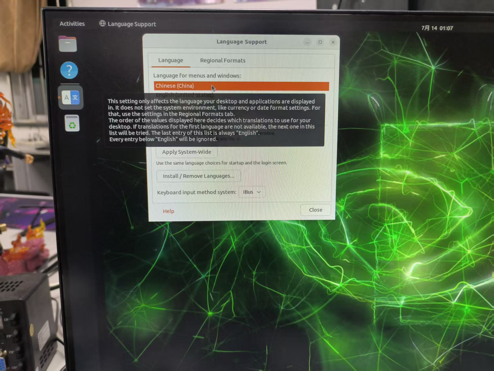

<p align="center"><strong>图 42</strong> 切换中文</p>

重启后会提示是否将标准文件夹更名为中文，建议选保留旧名称，如图 43

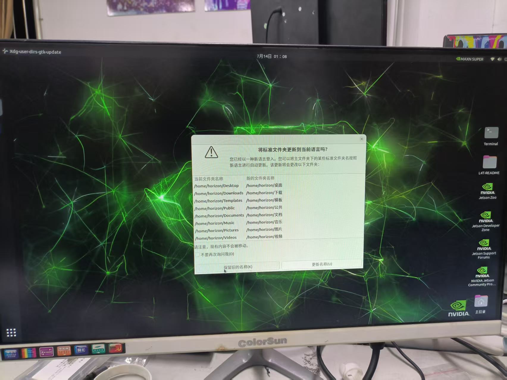

<p align="center"><strong>图 43</strong> 保留旧名称</p>

##### （3）修复浏览器并卸载无用软件

见另一篇文章：《 Jetson Orin 在Ubuntu 22下无法打开浏览器的解决办法 》

执行以下命令卸载部分无用的预装snap应用，节省空间，命令：

```
sudo apt-get remove simple-scan gnome-mahjongg aisleriot gnome-mines gnome-sudoku
```

#### 2. 配置 OpenCV（带 CUDA 扩展）

##### （1）确认自带 OpenCV 情况

Jetson 官方 JetPack 预装 OpenCV，但**不带 CUDA 扩展**。可参考我的另一篇文章《 Ubuntu OpenCV4 配置教程 》重新编译带 CUDA 的版本。

与 PC 版不同，补充依赖只需下载 `gtk2.0`，且无需 `aptitude`，直接 `apt` 安装即可，无冲突。

编译时注意：
- 选择启用 `pkg-config` 的命令版本
- cmake 指令中的 CUDA 版本（也可不指定具体版本）
- `cuda_arch`（Xavier 为 72，Orin 为 87）
- contrib 地址要配置正确
- 部分 contrib 依赖需要代理（需开启全局模式），否则可直连下载或直接断网编译

**注意：** Jetson 架构为 ARM64，编译时需要指定 `CMAKE_CXX_FLAGS` 和合适的 `CUDA_ARCH_BIN`：

| Jetson 型号 | CUDA 架构版本 (CUDA_ARCH_BIN) |
|-------------|------------------------------|
| Orin Nano/NX | 87 |
| Orin AGX | 87 |
| Xavier NX | 72 |
| Xavier AGX | 72 |
| TX2 | 62 |

#### 3. 配置 ROS/ROS2 开发环境

##### （1）安装 ROS（根据 JetPack 版本选择，使用 fishros）

```bash
# Ubuntu 20.04 (JetPack 5) 安装 ROS Noetic
# Ubuntu 22.04 (JetPack 6) 安装 ROS2 Humble
```

##### （2）源码编译注意事项

源码编译安装一些组件（如 ceres 2.20 或 OpenCV）时，务必注意编译时若使用 `make -j6`，需留意内存占用，避免爆 swap 导致系统卡死。

##### （3）串口驱动配置

与 PC 版 Ubuntu 22 相同，JetPack 6 的 ARM 版 Ubuntu 22 也需要先卸载 `brltty` 才能正常进行串口赋权。但不同之处在于，JetPack 的 ARM 版 Ubuntu 22 没有原生的 USB 串口驱动，需要自行编译安装。
参考解决方法：https://blog.insmtr.com/2025/04/24/2025.4.24%20CH340/
安装后，`ttyUSBX` 串口会识别为 `ttyCH341USBX`，`ttyACMX` 的不变。

##### （4）安装常用开发软件

建议安装 nomachine、VS Code 等常用开发软件。

##### （5）配置 RM 视觉环境

由于已经安装了 CUDA 和 TensorRT，在配置 Horizon_Rm_Vision_26 环境时不再需要安装 CUDA、CUDNN 和 TensorRT 等组件，只需补充其他组件和 OpenVINO 即可。并且目前版本的 Horizon_Rm_Vision_26 已可脱离 OpenVINO，因此可以选择不安装 OpenVINO。

### 附录：Jetson 常用命令速查

```
jetson_release       # 查看 Jetson 型号与 JetPack 版本
jtop                 # 实时监控 CPU/GPU/温度/功耗
sudo nvpmodel -m <N> # 切换功耗模式
sudo jetson_clocks   # 锁定最高频率
ls /dev/video*       # 查看摄像头设备
v4l2-ctl --all       # 查看摄像头信息
tegrastats           # 查看实时功耗与温度
```

### 附录：参考链接与资源

- [NVIDIA Jetson 官方文档](https://developer.nvidia.com/embedded/jetson)
- [NVIDIA SDK Manager 下载](https://developer.nvidia.com/sdk-manager)
- [Jetson Community Forums](https://forums.developer.nvidia.com/c/agx-autonomous-machines/jetson-embedded-systems/)
- [Jetson Download Center](https://developer.nvidia.com/embedded/downloads)
